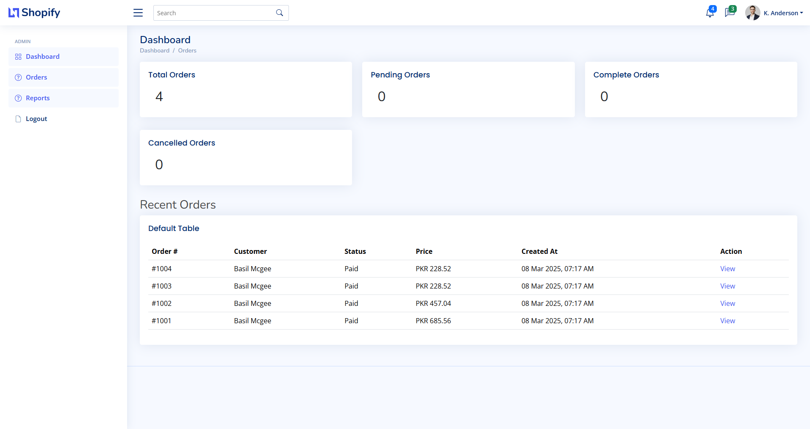
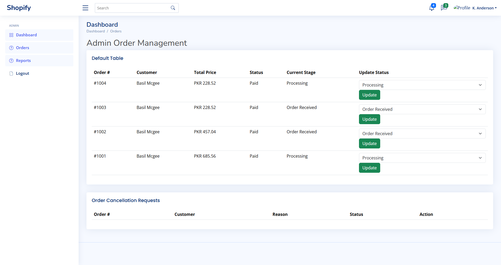
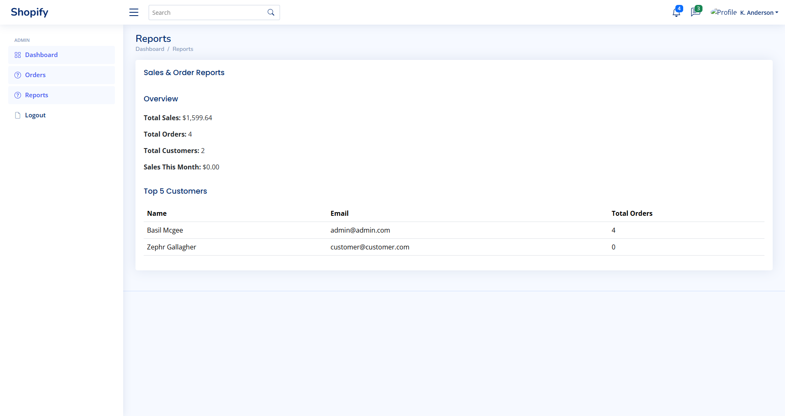

# 🛍️ Demo Shopify Customer Portal (for reference only)

A modern, Laravel-powered application that integrates seamlessly with the Shopify API to enhance the post-purchase experience for customers.  
Customers can log in using their Shopify credentials, view order histories, download invoices, and manage their profiles — all from a clean, responsive dashboard.

---

## 🚀 Key Features

- 🔐 Secure customer login via Shopify OAuth or email
- 📦 Order history viewer with real-time sync from Shopify
- 🧾 PDF invoice downloads for all orders
- 🧑 Profile management (name, contact, password)
- 🛠 Admin panel for tracking users, orders, and notes
- 📡 Shopify Webhook & API integration for real-time updates
- ✉️ Optional email notifications (Laravel Notification system)

---

## ⚙️ Tech Stack

| Layer | Technologies |
|-------|--------------|
| Backend | Laravel 10+ |
| Frontend | Blade + Tailwind CSS |
| APIs | Shopify Admin API, Storefront API |
| Auth | Laravel Breeze / Passport / Sanctum |
| DB | MySQL or PostgreSQL |
| Misc | Shopify OAuth, Laravel Jobs, Webhooks |

---

## 📸 Screenshots

> *(Add screenshots in a `screenshots/` folder and link them here)*





---

## ⚡ Installation Guide

```bash
# Clone the repo
git clone https://github.com/umerdev228/shopify-portal.git
cd shopify-portal

# Install backend dependencies
composer install

# Install frontend dependencies
npm install && npm run build

# Set up environment variables
cp .env.example .env
php artisan key:generate

# Add your Shopify credentials in .env
SHOPIFY_API_KEY=your_key
SHOPIFY_API_SECRET=your_secret
SHOPIFY_STORE_URL=yourshop.myshopify.com
SHOPIFY_REDIRECT_URI=https://yourapp.com/callback

# Run migrations
php artisan migrate

# Launch the app
php artisan serve
```

---

## 🔗 Live Demo

> *(Add link if deployed)*  
[🔗 View Live Portal](https://your-shopify-portal.example.com)

---

## 📄 License

This project is open-source under the [MIT License](LICENSE).

---

## 👨‍💻 Author

**Muhammad Umer**  
Full Stack Developer (Laravel · Vue.js · Electron.js)  
[LinkedIn](https://linkedin.com/in/your-profile) | [Upwork](https://upwork.com/freelancers/your-upwork) | [Fiverr](https://fiverr.com/your-fiverr) | [Email](mailto:your@email.com)

---

## 🤝 Contributions

Feel free to fork, submit pull requests, or suggest features.  
This portal can be customized to match various post-purchase workflows.
